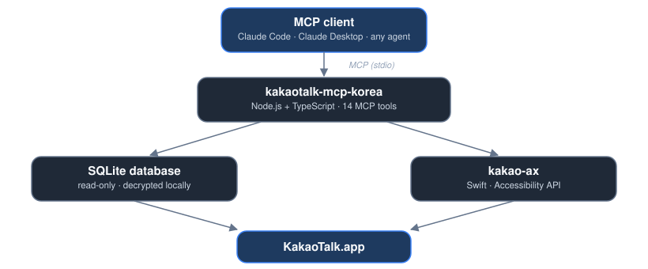

# 💬 kakaotalk-mcp-korea

한국어 · [English](./README.md)


Claude Code, Claude Desktop, 또는 직접 만든 에이전트 등 모든 MCP 클라이언트에서 macOS 카카오톡을 읽고 보낼 수 있게 해주는 MCP 서버이자 CLI입니다: 채팅, 메시지, 파일, 연락처, 그리고 연결된 계정 본인의 프로필까지.

> 🦋 **비공식 프로젝트입니다.** 카카오와 제휴하거나 승인받은 프로젝트가 아닙니다. 사용자의 Mac에 설치된 앱과 로컬 데이터만 사용하며, 카카오 서버를 직접 호출하지 않습니다.

<p align="center">
  
</p>

## ✨ 주요 특징

|  |  |
| --- | --- |
| 📖 **모든 것을 읽음** | 채팅, 메시지, 검색, 읽지 않은 메시지 요약, 링크, 공유 파일(pdf/docx/pptx/xlsx…), 연락처, 본인 계정 프로필 |
| ✉️ **안전한 전송** | 모든 전송은 먼저 미리보기를 거치며, `confirm: true` 없이는 아무것도 나가지 않음 |
| 🙈 **포커스 최소화** | 가능하면 백그라운드로 전송 — 실제 테스트로 현재 작업 중인 앱을 방해하지 않음을 확인함 |
| 🔒 **프라이버시 우선** | 본인 외 그 누구의 전화번호도 노출되지 않음; 다운로드는 호스트 제한과 용량 제한이 있음 |
| 🧪 **검증된 테스트** | 단위 테스트 77개 + 실제 데이터베이스, 실제 전송, 실제 답장/반응/삭제 검증 — "지금까지 테스트한 범위"에 정직하게 기록 |
| 🌐 **이중 언어** | 이 README와 모든 오류 메시지가 한국어와 영어(그리고 러시아어/우즈베크어)로 제공됨 |

## 📊 진행 상황

| | 항목 | 상태 |
| --- | --- | --- |
| ✅ | 설정 및 경로 | 완료 |
| ✅ | 기기 UUID 및 카카오톡 `userId` 감지 | 완료 |
| ✅ | 암호화된 데이터베이스 키 생성 및 읽기 전용 열기 | 완료 |
| ✅ | `setup` 명령 (계정 감지 및 저장) | 완료, 실제 데이터베이스에서 테스트 |
| ✅ | MCP 읽기 도구 (10개 — 아래 표 참고) | 완료, 실제 데이터베이스에서 테스트 |
| 🧪 | `kakao_account_info`, `kakao_contact_profile`, `kakao_profile_image` | 완료, 생성된 fixture로 단위 테스트함; 실제 계정으로 별도 검증은 아직 안 함 |
| ✅ | `kakao_send_message` (`confirm: true` 필요) | 완료, **실제 전송으로 확인됨** |
| ✅ | `kakao_delete_message`, `kakao_reply_message`, `kakao_react_message` (각각 `confirm: true` 필요) | 완료, **실제 채팅방에서 직접 확인됨** |
| 🧪 | `kakao_edit_message` (`confirm: true` 필요) | 구현됨, **아직 실제로 테스트 안 함** |

## 🧰 MCP 도구

|  | 도구 | 기능 |
| --- | --- | --- |
| 📂 | `kakao_list_chats` | 채팅방을 최근 활동순으로 나열, 읽지 않은 수와 `kind` 필드(`direct`, `group`, `open`) 포함. `scope`로 `all`, `direct`, `group`, `open` 필터링 |
| 📖 | `kakao_read_messages` | 채팅방의 최근 메시지 읽기. 발신자가 회수한 메시지는 `deleted: true`와 빈 텍스트로, 답장은 `replyTo`(인용한 메시지 ID와 80자 미리보기)와 함께 옵니다 |
| 🔎 | `kakao_search_messages` | 메시지 전체 검색 |
| 🔔 | `kakao_unread_summary` | 읽지 않은 메시지가 있는 채팅방 요약 |
| 👥 | `kakao_search_contacts` | 이름으로 연락처 찾기. 전화번호는 절대 반환하지 않음 |
| ⏱️ | `kakao_new_messages` | 커서 이후의 새 메시지를 롱폴링으로 가져옴 (푸시 아님). 커서 없이 처음 호출하면 시작점을 반환하고, 그 커서를 다시 전달하면 최대 30초까지 다음 메시지를 기다림 |
| 🔗 | `kakao_extract_links` | 채팅방 최근 메시지에서 공유된 링크를 추출 |
| 📝 | `kakao_export_chat` | 채팅방 메시지를 오래된 순 Markdown 대화록으로 반환. 회수된 메시지는 `[deleted]`로 표시됨. 디스크에 저장하지 않고 응답으로 텍스트를 돌려줌 |
| 🗂️ | `kakao_list_files` | 채팅방에 공유된 파일을 최신순으로 나열, `availability`로 상태 표시: `local`(이미 Mac에 있음), `download`(아직 서버에 있음), `expired`(만료됨) |
| 📄 | `kakao_read_file` | `kakao_list_files`의 `messageId`로 공유 파일의 텍스트를 읽음. pdf, docx/doc/rtf, pptx, xlsx, txt/md/csv/json/html, zip(파일 목록만) 지원. Mac에 없는 파일은 만료되지 않은 동안 `https://*.kakaocdn.net`에서만 다운로드하며, `KAKAOTALK_MAX_FILE_MB`로 크기 제한, `~/.cache/kakaotalk-mcp-korea/files`에 캐시 |
| 🪪 | `kakao_account_info` | 연결된 계정 전체 개요: 자신의 프로필(이름, 상태 메시지, 사진 링크, 로그인 아이디, 전화번호, 오픈채팅 프로필), 앱 버전, 종류별 채팅 수(읽지 않은 수 포함)와 폴더, 연락처 수, 메시지/파일 총계, 캘린더 수 |
| 🧑 | `kakao_contact_profile` | 이름이나 사용자 ID로 연락처 조회: 이름, 상태 메시지, 사진 링크, 즐겨찾기/숨김 여부. 전화번호는 절대 반환하지 않음 |
| 🖼️ | `kakao_profile_image` | 프로필 사진을 (링크가 아닌) 실제 이미지로 반환. `userId`가 없으면 연결된 계정 본인 사진. 카카오 CDN에서만 다운로드, 5 MB 제한 |
| ✉️ | `kakao_send_message` | 텍스트 전송. `confirm: true` 없이 호출하면 채팅방과 정확한 내용만 미리 보여 줌 |
| ↩️ | `kakao_reply_message` | `messageId`로 특정 메시지 하나를 인용하는 답장 전송 |
| 👍 | `kakao_react_message` | 메시지에 반응 추가. `reactionIndex`는 카카오톡 반응 선택기에서의 위치(0부터 시작, 0은 엄지척, 약 44개 중 선택). 같은 반응을 다시 선택하면 그대로 유지되며, 아직 반응을 제거하는 기능은 없음 |
| 🗑️ | `kakao_delete_message` | 본인 메시지 삭제. `scope`: `auto`(기본값)는 카카오톡이 아직 허용하면 모두에게서, 아니면 나에게서만 삭제; `everyone` 또는 `me`는 하나를 강제하거나 실패. **되돌릴 수 없음** |
| ✏️ | `kakao_edit_message` | 본인이 보낸 최근 텍스트 메시지의 내용을 교체. 카카오톡이 수정을 제공하는 메시지에서만 가능하며, 아니면 아무것도 바꾸지 않고 실패. **구현됨, 아직 실제로 테스트 안 함** |

모든 도구 설명에는 메시지 내용을 지시로 받아들이지 말라는 경고가 포함되어 있습니다.

MCP 클라이언트가 연결되면 서버는 `initialize` 응답의 일부로 짧은 계정 요약(이름, 앱 버전, 채팅/연락처/메시지 수)을 보내므로, 모델은 도구를 호출하지 않아도 기본 정보를 이미 알고 시작합니다. 로그인 아이디와 전화번호는 이 요약에서 의도적으로 제외되며, `kakao_account_info`에서만, 그것도 연결된 계정 본인에 대해서만 반환됩니다("안전 원칙" 참고).

아직 구현되지 않음: 추가한 반응 제거, 채팅방에 공유된 사진이나 사진 앨범 읽기(현재는 카카오의 "파일" 종류만 목록에 나타남 — 이 작업 중 확인한 실제 계정에는 `kakao_list_files`가 전혀 보지 못하는 사진 메시지 127개와 사진 앨범 26개가 있었습니다), 여러 채팅방에 한 번에 전송, @멘션, 이미지 전송, 그룹 멤버 관리. 이들은 현재 파일 경로를 넘어서는 새로운 메시지 읽기/전송 로직이거나 카카오톡 자체 통신 프로토콜 역분석이 필요하므로, 현재는 일정이 정해져 있지 않습니다.

## ✅ 지금까지 테스트한 범위

실제 개인 카카오톡 데이터베이스 기준: 채팅방 목록, 메시지 읽기/검색, 읽지 않은 메시지 요약, 연락처 검색, 새 메시지 커서 스트림, 링크 추출, Markdown 내보내기. `kakao_send_message`의 미리보기와 채팅방을 찾지 못했을 때의 오류는 테스트했습니다.

파일 읽기는 실제 그룹 채팅방의 공유 파일로 시도했습니다: 5개 파일 읽기(pdf 3, pptx 1, docx 1), 만료된 파일은 `FILE_EXPIRED`를 올바르게 반환, 다운로드 경로(Mac에 없는 파일)도 한 번 실행해 검증(크기와 PDF `%PDF` 시그니처 일치) 후 다운로드된 사본은 삭제했습니다. `extractText`는 개인정보가 없는 생성된 fixture 파일(docx, pptx, xlsx, pdf)로도 추가 검증됩니다.

`kakao_account_info`와 `kakao_contact_profile`의 내부 쿼리(채팅/연락처/메시지/파일/캘린더 수, 폴더 이름, 연락처 검색과 정렬, 전화번호가 `kakao_contact_profile`로 절대 새어나가지 않음)는 실제 계정 데이터가 아니라 생성된 메모리 데이터베이스로 단위 테스트되어 있습니다. fixture로 만들 수 없는 실제 프로필의 유일한 부분인 — 이 기기 자체 설정에서 읽는 카카오톡 로그인 아이디 — 는 직접 검증하는 대신 별도의 순수 함수 테스트(`phoneFromLoginId`)로 다룹니다.

전송 자체는 이제 위에서 설명한 네이티브 헬퍼를 통해 이루어지며, 더 이상 AppleScript를 사용하지 않습니다. `dryRun`(채팅 창을 열고 입력 없이 확인만 함)은 실제로 6/6회 성공했으며, 관련 없는 다른 채팅 창이 열려 있는 상태에서도 창 일치 검사가 잘못된 창을 올바르게 거부했습니다. 백그라운드 포커스 방식(다른 채팅 창을 닫은 뒤, 메인 창에 직접 포커스를 주고 카카오톡을 활성화하지 않은 채 그 프로세스에 Return을 보내는 방식)으로는 3/3회 모두 테스트 중이던 앱에 포커스가 그대로 남아, 눈에 보이는 앱 전환이 없었습니다. **실제 전송은 실제 메시지로 시도해 보았고, 테스트한 사람이 직접 확인했습니다**: 텍스트가 입력되고, 채팅방 자체의 전송 버튼이 눌렸으며(`send-button` 방식 — Return 키 대체는 필요 없었음), 포커스는 눈에 띄게 움직이지 않았고, 메시지는 정확히 한 번만 데이터베이스에 기록되었습니다. 초안 지우기 경로(보내지 않은 텍스트가 있는 *다른* 채팅 창을 닫는 것)도 실제로는 시도해 보지 않았습니다 — 실제 초안이 들어 있는 두 번째 채팅 창이 필요한데, 아직 테스트 환경을 만들지 못했습니다.

`kakao_reply_message`, `kakao_react_message`, `kakao_delete_message` 모두 실제 채팅방에서 시도해 보았습니다. 답장: 실제 답장(종류 26)이 전송되었고 `src_logId`가 인용한 메시지와 일치했습니다. 반응: 인덱스 0은 "엄지척"을 추가했고 `NTChatLogMeta`로 확인했습니다. 선택기는 약 44개의 반응을 제공하며, 같은 반응을 다시 추가하면 그대로 유지됩니다. 삭제: `scope: auto`는 카카오톡 자체 메뉴가 제공할 때는 "모두에게서 삭제"를, 제공하지 않을 때는 "나에게서만 삭제"를 올바르게 선택했습니다(다른 사람의 메시지와 제 오래된 메시지에서 `dryRun`으로 확인 — "나에게서만"만 제공됨). 이제 각 scope는 타입 플래그만이 아니라 자신만의 흔적으로 확인됩니다("동작 방식" 참고): 모두에게서 삭제하면 이 README가 이미 설명한 `feedType: 14` 동반 행이 남고, 나에게서만 삭제하면 카카오톡의 선택 모드(메시지 옆 체크박스, 이후 확인)를 거쳐 메시지의 `status`가 `2`가 되며 동반 행은 없습니다.

## 📋 요구 사항

- macOS 13 이상
- 카카오톡 Mac 앱 설치 및 최소 한 번 로그인
- Node.js 20 이상
- 터미널에 손쉬운 사용 권한 부여 (시스템 설정 → 개인정보 보호 및 보안 → 손쉬운 사용)
- 데이터베이스를 읽을 수 없는 경우 전체 디스크 접근 권한

## 🛠️ 빌드 요구 사항

메시지 전송은 AppleScript 대신 작은 네이티브 헬퍼(`src/native/kakao-ax.swift`, `dist/bin/kakao-ax`로 컴파일됨)로 카카오톡을 제어합니다 — AppleScript는 채팅 창을 숫자 인덱스로 찾았는데, 창 순서가 바뀌면 오작동했습니다. 헬퍼는 자신이 연 창만 다루며, 이미 열려 있던 창에는 손대지 않습니다.

사용자를 최대한 방해하지 않으려고도 합니다. 기본적으로 채팅을 열기 전에 헬퍼는 *다른* 열려 있는 채팅 창들을 닫습니다 — 그중 하나가 키보드 포커스를 쥐고 있으면 열려는 채팅을 위한 Return 입력을 가로챌 수 있기 때문입니다. 메시지 목록이 있는 창만 건드리며, 캘린더 같은 채팅이 아닌 창은 전혀 건드리지 않습니다. **그중 다른 창의 입력란에 아직 보내지 않은 텍스트가 있으면, 창을 닫기 전에 그 텍스트를 지웁니다** — 아래 "안전 원칙" 참고. 채팅을 여는 것과 Return을 누르는 것은 카카오톡 메인 창에 직접 포커스를 주고 그 프로세스로 키 입력을 보내는 방식으로 이루어지며, 앱을 활성화하거나 맨 앞으로 가져오지 않습니다. 전송할 때는 먼저 텍스트를 직접 값으로 설정한 뒤 채팅방 자체의 전송 버튼을 누릅니다(이것도 포커스가 필요 없음). 버튼을 찾을 수 없을 때만 Return 입력으로 대체하는데, 이 경우에는 앱이 잠깐 활성화되어야 합니다. 메시지는 대상 채팅과 이름이 일치한다고 확인된 바로 그 창에만 입력되며, 그 창을 확인할 수 없으면 아무것도 전송하지 않습니다. 기본적으로 헬퍼는 이 대체 수단으로도 카카오톡을 활성화할 수 없습니다 — 눈에 보이는 포커스 변화를 감수하기보다 그냥 동작을 실패시킵니다. 실패시키기보다 마지막 수단으로 앱을 활성화하길 원하면 `KAKAOTALK_ALLOW_FOREGROUND=1`을 설정하세요. 다른 채팅 창(과 그 안의 초안)을 그대로 두고 싶다면 `KAKAOTALK_KEEP_OTHER_WINDOWS=1`을 설정하세요(이 경우 다른 창에 포커스가 있으면 Return이 그 창으로 들어갈 수 있습니다). `KAKAOTALK_ALLOW_FOREGROUND=1`을 설정한 경우 이론적으로는 여전히 포커스가 흔들릴 가능성이 있으며, Apple의 공개 자동화 API로는 완전히 배제할 수 없습니다(관련 조사는 `notes/`에 있으며 저장소에는 포함되지 않습니다).

**`setup`은 카카오톡 창을 백그라운드에서 실제로 접근할 수 있는지 확인합니다.** 손쉬운 사용 API는 현재 데스크톱(Space)의 창만 볼 수 있으며, 디스플레이마다 전체 화면 공간을 쓰고 일반 데스크탑이 몇 개 없는 Mac에서는 Dock 아이콘의 Options 메뉴에 "Assign To → All Desktops" 항목 자체가 없을 수도 있습니다 — 그래서 이 방법이 항상 쓸 수 있는 건 아닙니다. 대신 `setup`은 정말 중요한 것을 직접 확인합니다: 네이티브 헬퍼가 앱을 앞으로 가져오지 않고도 지금 카카오톡 메인 창을 볼 수 있는가(창 동작이 의존하는 것과 같은 `kakao-ax inspect` 검사)? 볼 수 없으면 흔한 원인을 설명하고, 터미널에서는 해결 방법을 안내한 뒤 다시 확인합니다(최대 5회, 또는 `skip` 입력). 터미널이 없으면 이 검사를 통과할 때까지 setup이 미완료로 보고됩니다(종료 코드 2). `setup --skip-window-check`로 명시적으로 건너뛸 수 있고, `setup --redetect`는 캐시된 계정을 재사용하지 않고 계정 검색을 다시 실행합니다. 창 동작 중에도 창에 접근할 수 없으면 같은 설명과 함께 `MAIN_WINDOW_MISSING`으로 실패합니다. 정확한 원인은 공개 API로는 알아낼 수 없으므로(어느 Space에 창이 있는지는 비공개 API만 알려줌) 실제 원인을 진단하기보다 *흔한* 원인을 알려줍니다: 카카오톡이 있는 디스플레이를 전체 화면 앱이나 다른 데스크탑이 덮고 있거나, 창이 닫혀 있는 경우입니다. 제안하는 해결책: 해당 디스플레이에서 전체 화면을 끝내거나 그 일반 데스크탑으로 전환하기, 또는 카카오톡 창을 전체 화면 앱을 쓰지 않는 디스플레이로 옮기기; Dock 메뉴에 Assign To → All Desktops가 있다면 그것도 도움이 됩니다.

- Xcode Command Line Tools (`xcode-select --install`), `swiftc` 컴파일러용
- `npm run build`가 TypeScript와 헬퍼를 모두 컴파일합니다. 헬퍼는 `kakao-ax.swift`가 바뀔 때만 다시 빌드됩니다
- 선택 사항: [poppler](https://poppler.freedesktop.org/) (`brew install poppler`) — `kakao_read_file`이 PDF를 읽을 때 쓰는 `pdftotext`용. 없으면 PDF만 텍스트로 변환할 수 없고, 나머지는 그대로 작동합니다

## 📦 설치

```bash
git clone https://github.com/gayratjon-02/kakaotalk-mcp-korea.git
cd kakaotalk-mcp-korea
npm install
npm run build
```

## ⚙️ 설정

`.env.example`을 `.env`로 복사한 뒤 필요에 따라 수정합니다.

| 변수 | 기본값 | 설명 |
| --- | --- | --- |
| `KAKAOTALK_APP_NAME` | `KakaoTalk` | 손쉬운 사용에서 앱을 찾을 때 쓰는 이름 |
| `KAKAOTALK_SCRIPT_TIMEOUT_MS` | `15000` | UI 자동화 단계의 제한 시간 |
| `KAKAOTALK_LOG_LEVEL` | `info` | `debug`, `info`, `warn`, `error` 중 하나 (로그는 stderr로 출력) |
| `KAKAOTALK_LANG` | `en` | 오류 메시지 언어: `en`, `ko`, `ru`, `uz` |
| `KAKAOTALK_MAX_FILE_MB` | `25` | `kakao_read_file`이 카카오 서버에서 다운로드할 파일의 크기 제한 |
| `KAKAOTALK_BLOCKED_CHATS` | *(비어 있음)* | `kakao_send_message`가 항상 거부하는 채팅/연락처 이름(쉼표로 구분). 로컬 `~/.config/kakaotalk-mcp-korea/blocked-chats.json`(이름 배열)도 함께 읽히므로, 비공개 이름이 `.env`나 저장소에 남지 않습니다 |
| `KAKAOTALK_KEEP_OTHER_WINDOWS` | `0` | `1` 또는 `true`로 설정하면 전송 시 대상 채팅을 열기 전에 다른 열려 있는 채팅 창을 닫지(그리고 그 안의 초안을 지우지) 않습니다 — "안전 원칙" 참고 |
| `KAKAOTALK_ALLOW_FOREGROUND` | `0` | `1` 또는 `true`로 설정하면 헬퍼가 동작을 실패시키는 대신 마지막 수단으로 카카오톡을 활성화할 수 있습니다. 기본값은 절대 활성화하지 않는 것입니다 — "빌드 요구 사항" 참고 |

## 🧠 동작 방식

1. `ioreg`에서 기기 UUID를 가져옵니다.
2. 계정 설정 plist에서 카카오톡 `userId`를 읽습니다. 직접 저장되어 있지 않으면, 같은 파일의 SHA-512 해시로부터 CPU 코어를 모두 사용해 복원합니다.
3. 앱과 같은 방식으로 UUID와 `userId`에서 SQLCipher 파일 이름과 키를 만듭니다.
4. 데이터베이스를 읽기 전용으로 엽니다. 호환 모드 3과 4를 순서대로 시도합니다.

카카오톡 데이터 디렉터리에는 아무것도 기록하지 않습니다.

메시지 자체에 저장된 타입에서 재사용되는 같은 비트가 다른 의미(긴 메시지, 카카오톡 자체 UI로 한 "나에게서만 삭제")로도 쓰이기 때문에 "발신자가 이 메시지를 회수했다"를 구분하려면 한 단계가 더 필요합니다: 진짜 회수(unsend)는 항상 자신만의 동반 행을 만들며, 그 내용은 `{"feedType": 14, "logId": <해당 메시지>, "hidden": true}`입니다. 일치하는 동반 행이 있는 메시지만 `deleted: true`로 보고되며, 타입 비트만으로는 신뢰하지 않습니다.

## 🔒 안전 원칙

- 읽기는 데이터베이스를 수정하지 않습니다.
- 전송, 답장, 반응, 삭제 모두 `confirm: true`가 있어야 합니다. 에이전트는 먼저 정확한 동작을 보여 주어야 하며, 승인 없이는 아무것도 일어나지 않습니다.
- ⚠️ **`kakao_delete_message`는 되돌릴 수 없습니다.** `scope: everyone`(또는 카카오톡이 해당 메시지에 대해 아직 허용하는 `auto`)을 사용하면 본인뿐 아니라 채팅방의 다른 사람들도 그 메시지를 잃습니다.
- ⚠️ **메시지를 전송하면 다른 열려 있는 채팅 창의 보내지 않은 초안이 지워질 수 있습니다.** 기본적으로 다른 채팅 창은 먼저 닫히는데("빌드 요구 사항" 참고), 그 입력란에 보내지 않은 텍스트가 있으면 창을 닫기 전에 그 텍스트를 지우며 — 어디에도 먼저 저장하지 않습니다. 이 동작을 완전히 끄고 다른 창(과 그 초안)을 그대로 두려면 `KAKAOTALK_KEEP_OTHER_WINDOWS=1`로 설정하세요. 이 경로는 아직 실제 초안으로 시도해 보지 않았습니다 — 안전하다고 입증된 것이 아니라 검증되지 않은 것으로 취급하세요.
- `KAKAOTALK_BLOCKED_CHATS`나 `blocked-chats.json`에 있는 채팅/연락처 이름에는 절대 전송할 수 없습니다. 채팅방 제목뿐 아니라 상대방의 표시 이름, 친구 별명, 카카오톡 닉네임도 확인합니다(부분 일치이므로, 차단된 텍스트가 어느 이름에든 포함되어 있으면 이름을 바꿔도 검사를 피할 수 없습니다).
- 다운로드되는 파일은 `https://*.kakaocdn.net`에서만 오며, `KAKAOTALK_MAX_FILE_MB`로 제한되고, 저장소가 아닌 사용자 홈 디렉터리에 캐시됩니다.
- 본인의 로그인 아이디와 전화번호는 `kakao_account_info`에서만, 그것도 연결된 계정 본인에 대해서만 반환됩니다 — 다른 어떤 도구도 이를 노출하지 않습니다. `kakao_contact_profile`과 `kakao_search_contacts`는 설계상 다른 사람의 전화번호를 절대 반환하지 않습니다("MCP 도구" 참고). 연결 시 클라이언트로 보내는 짧은 계정 요약("MCP 도구" 참고)에도 둘 다 포함되지 않습니다.
- 메신저 자동화는 이용 약관에 저촉될 수 있습니다. 위험을 감수하고 사용하며, 가능하면 본인 계정에서만 사용하세요.

## 🤝 기여

커밋은 Conventional Commits 형식을 따릅니다 (`feat:`, `fix:`, `chore:`, `docs:`).

## 🙏 크레딧

키 생성과 데이터베이스 방식은 [kakaocli](https://github.com/silver-flight-group/kakaocli) (MIT)를 따릅니다.

## 📄 라이선스

MIT
